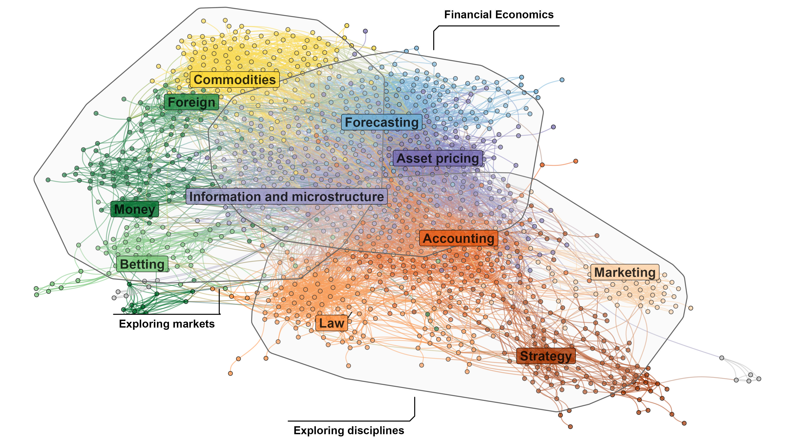

::: {.columns .article-hero}
::: {.column}
{fig-align="center" .article-hero-image}
:::

::: {.column}
::: {.article-links}
[HAL](https://hal.science/hal-05121997/) · [Google Scholar](https://scholar.google.com/scholar?q=The%20Dissemination%20of%20Fama%20%281970%29%3A%20A%20Bibliometric%20Analysis)

[Shiny app](https://019c241f-91f4-a63b-1097-ed53083ffbbc.share.connect.posit.cloud) · [Code](https://github.com/tdelcey/research/tree/main/fama_1970)
:::
:::
:::
