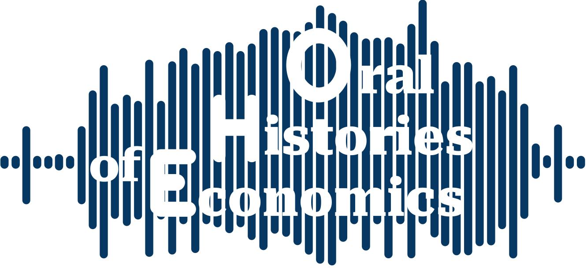

## Presentation

Oral Histories of Economics is a research project gathering and disseminating oral sources about the history of economics. The materials gathered by the project are freely accessible to researchers and to anyone interested in learning more about the evolution of economics and economists' practices. This team of the project is Francesco Sergi (project leader), Pierrick Dechaux (project leader), Dorian Jullien, Thomas Delcey, and Romain Plassard.

Visit the website and the collections: [link](#)

<!-- ## Published In -->

<!-- This article was published in *History of Political Economy, forthcoming*. [Publisher's Link](#) -->

