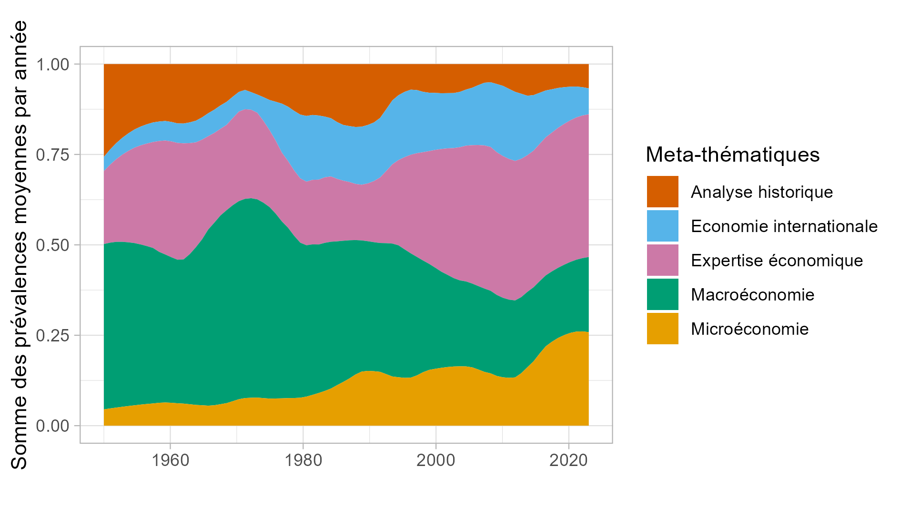

::: {.columns .article-hero}
::: {.column}
{fig-align="center" .article-hero-image}
:::

::: {.column}
::: {.article-links}

  <i class="bi bi-journal-text"></i> *Revue Economique*

  <a href="https://doi.org/10.3917/reco.763.0363" class="article-btn"><i class="bi bi-link-45deg"></i> DOI</a>
  <a href="https://scholar.google.com/scholar?q=La%20Revue%20Economique%20%281950-2025%29%2C%20une%20perspective%20quantitative" class="article-btn"><i class="bi bi-mortarboard"></i> Google Scholar</a>
  <a href="https://shs.hal.science/halshs-05360642v1" class="article-btn"><i class="bi bi-file-earmark-text"></i> HAL</a>

  <a href="https://doi.org/10.5281/zenodo.15083220" class="article-btn"><i class="bi bi-download"></i> Annexe</a>
  <a href="annexe.html" class="article-btn"><i class="bi bi-box-arrow-up-right"></i> View annexe</a>
  <a href="https://github.com/tdelcey/research/tree/main/revue_economique" class="article-btn"><i class="bi bi-github"></i> Code</a>

:::
:::
:::
