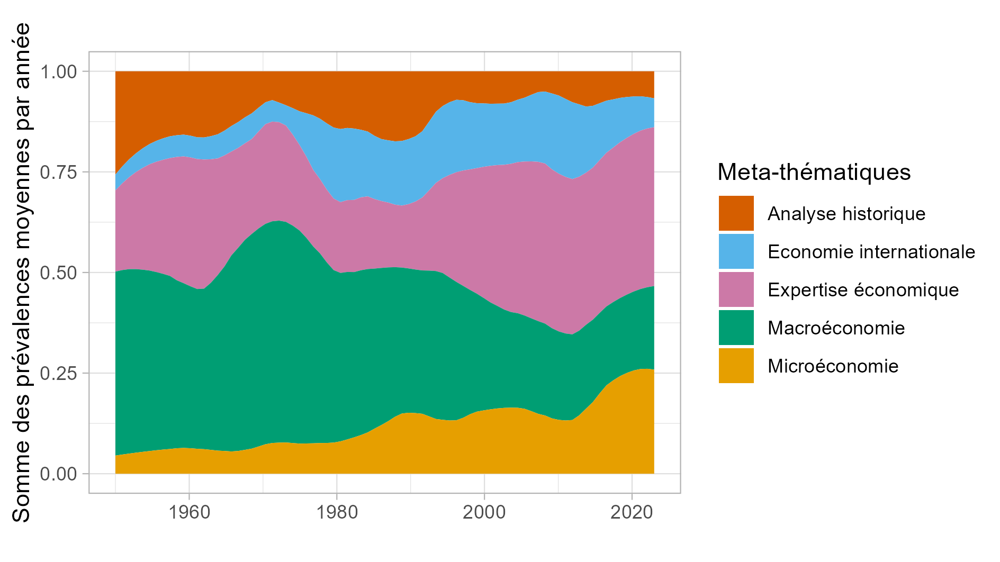

::: {.article-hero-image}

:::

### Abstract

This article analyzes the evolution of the _Revue Economique_ from its creation in 1950 to 2025. We trace its history, its central place in French economic research, and the transformations of its editorial content. Our study is based on a probabilistic topic model, an unsupervised machine learning classification method that we apply to the full texts of the _Revue Economique_. Initially positioned between a reformist approach and an openness to other social sciences, the journal gradually became standardized around quantitative methods, with a central focus on macroeconomics. We then show a shift toward a more applied and empirical approach at the end of the 20th century. Beyond the topics covered, the final section discusses pluralism within the journal, as well as the influence of internationalization and the feminization of the discipline.

### Links

::: {.article-links}
[DOI](https://doi.org/10.3917/reco.763.0363) · [Google Scholar](https://scholar.google.com/scholar?q=La%20Revue%20Economique%20%281950-2025%29%2C%20une%20perspective%20quantitative) · [HAL](https://shs.hal.science/halshs-05360642v1) · [Annexe en ligne](https://doi.org/10.5281/zenodo.15083220) · [Code](https://github.com/tdelcey/research/tree/main/revue_economique)
:::
