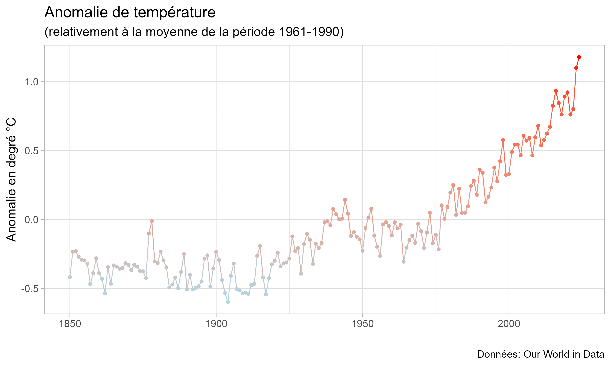

::: {.course-hero}
::: {.course-hero-text}
Un enseignement de deuxième année à l'IUT de l'université de Bourgogne qui vulgarise les principaux points clefs du sixième rapport du GIEC et du Haut Conseil pour le Climat, ainsi que les concepts clefs de l'économie de l'environnement. Le cours est intégré dans un projet de groupe où les étudiant.es analysent le bilan carbone d'une entreprise et proposent une solution d'atténuation.
:::

::: {.course-hero-image}
{height=320 fig-align="center"}
:::
:::

::: {.panel-tabset}

## Slides

```{=html}
<div id="slides-eco"></div>
<noscript>
  <p>JavaScript est requis pour changer de slide ici.
    Accédez directement :
    <a href="chapitre_0_slides.html">Chapitre 0</a>, <a href="chapitre_1_slides.html">Chapitre 1</a>, <a href="chapitre_2_slides.html">Chapitre 2</a>, <a href="chapitre_3_slides.html">Chapitre 3</a>.
  </p>
</noscript>
<script>
  window.addEventListener('DOMContentLoaded', function() {
    initSlideViewer('#slides-eco', [
      { file: 'chapitre_0_slides.html#/', label: 'Chapitre 0 - Présentation du projet' },
      { file: 'chapitre_1_slides.html#/', label: 'Chapitre 1 - La crise écologique' },
      { file: 'chapitre_2_slides.html#/', label: 'Chapitre 2 - Qui réchauffe le climat ?' },
      { file: 'chapitre_3_slides.html#/', label: 'Chapitre 3 - La tragédie des communs' },
      { file: 'chapitre_4_slides.html#/', label: 'Chapitre 4 - Les politiques climatiques' },
    ], { storageKey: 'lastSlideEco' });
  });
</script>
```

## Syllabus

### Cible

Étudiant.es BUT2

### Description et objectifs

Le cours introduit les étudiant.es aux enjeux de la crise écologique. Il vulgarise les points clefs concernant le changement climatique, les principaux facteurs d'émissions et les enjeux socio-économiques associés à la transition écologique. Le cours est intégré dans un projet de groupe où les étudiant.es analysent l'empreinte carbone d'une entreprise et proposent une solution d'atténuation à travers le cadre de la société à mission. Les étudiant.es sont accompagnés par des intervenants extérieurs spécialistes de l'empreinte carbone et de la RSE.

Après ce cours, les étudiant.es devraient être capables de :

1. Comprendre les interactions entre activité économique et enjeux climatiques
2. Analyser et diagnostiquer l'empreinte environnementale d'un produit
3. Découvrir les démarches de transition bas carbone dans l'entreprise

### Évaluation

- Devoir sur table (chapitres 1 à 5).
- Soutenance orale (projets de groupe).

### Plan du cours

- Chapitre 0 : Présentation du projet de groupe (1h).
- Chapitre 1 : La crise climatique (2h).
- Chapitre 2 : Qui réchauffe le climat ? (2h).
- Chapitre 3 : La tragédie des communs (2h).
- Chapitre 4 : Les politiques climatiques (2h).
- Chapitre 5 : Transition juste et inégalités (2h).

:::
