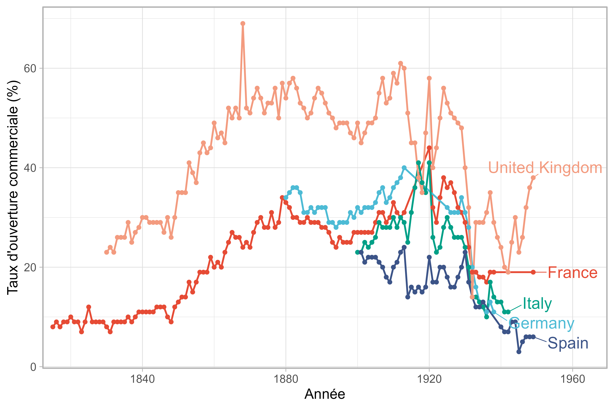

::: {.course-hero}
::: {.course-hero-text}
Un enseignement de deuxième année à l'IUT de l'université de Bourgogne qui introduit les étudiant.es aux enjeux de l'économie internationale. Le cours aborde dans un premier temps l'histoire des mondialisations et les faits stylisés contemporains, avant d'introduire les étudiant.es à la théorie du commerce international. Dans un troisième temps, le cours aborde la mise en oeuvre concrète du commerce international, en étudiant les politiques commerciales et les institutions internationales. L'un des objectifs de ce cours est d'éclairer les débats contemporains sur le protectionnisme, la mondialisation et les inégalités internationales.
:::

::: {.course-hero-image}
{height=320 fig-align="center"}
:::
:::

::: {.panel-tabset}

## Slides

```{=html}
<div id="slides-inter"></div>
<noscript>
  <p>JavaScript est requis pour changer de slide ici.
    Accédez directement :
    <a href="CM1_slides.html">CM1</a>, <a href="CM2_slides.html">CM2</a>.
  </p>
</noscript>
<script>
  window.addEventListener('DOMContentLoaded', function() {
    initSlideViewer('#slides-inter', [
      { file: 'CM1_slides.html#/', label: 'Chapitre 1 - Introduction et histoire de la mondialisation' },
      { file: 'CM2_slides.html#/', label: 'Chapitre 2 - Théorie du commerce international' }
    ], { storageKey: 'lastSlideSrc' });
  });
</script>
```

## Syllabus

### Cible

Étudiant.es BUT2

### Description et objectifs

Comprendre les principaux enjeux de l'économie internationale, des dynamiques de mondialisation aux politiques commerciales, et être capable d'analyser les effets des échanges internationaux sur les pays, les secteurs et les inégalités.

À l'issue de ce cours, les étudiant.es seront capables de :

1. Décrire les grandes phases de la mondialisation et les faits stylisés du commerce international ;
2. Expliquer les modèles classiques du commerce international et leurs prédictions ;
3. Analyser les politiques commerciales et leurs effets économiques ;
4. Identifier le rôle des institutions internationales et les débats contemporains (protectionnisme, régionalisation, inégalités).

### Plan du cours

Chaque thématique est abordée à la fois en CM et en TD. Le CM introduit les concepts clefs et le TD se concentre sur un approfondissement (interprétation de données, étude des textes fondateurs, exercices d'application).

- **Chapitre 1 :** Mondialisations et faits stylisés (CM)
  - Le TD associé revient sur les grands indicateurs du commerce international et leurs évolutions depuis le 19e siècle.
- **Chapitre 2 :** Théories du commerce international (CM)
  - Le TD associé revient sur les textes fondateurs (Ibn Khaldun, Adam Smith) et sur les exercices d'application des modèles classiques (avantage absolu, avantage comparatif).
- **Chapitre 3 :** Politiques commerciales et accords (CM)
  - Le TD associé porte sur des études de cas (Corée du Sud) et sur l'analyse de l'actualité (guerre commerciale).

### Évaluation

- 1 devoir sur table (100%), ensemble du cours ; questions de réflexion et analyse de données courtes.

:::
