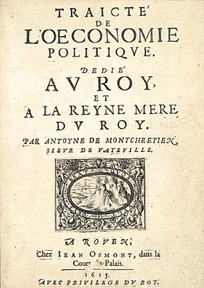

::: {.course-hero}
::: {.course-hero-text}
Cet enseignement de master porte sur l'histoire de la pensée économique. Partant du constat que la discipline économique est aujourd'hui largement investie et mobilisée dans les politiques publiques, ce cours adopte une approche historique pour comprendre comment cette situation s'est construite au fil du temps. Cette histoire de la pensée économique interroge les relations entre la pensée économique et la politique au sens large (autorités politiques, morales, administratives). Nous explorons d'abord l'autonomisation progressive vis-à-vis des autorités politiques et morales jusqu'à la révolution marginaliste à la fin du XIXe siècle. Nous analysons ensuite la montée en puissance des économistes au sein des administrations au XXe siècle.
:::

::: {.course-hero-image}
{height=320 fig-align="center"}
:::
:::

::: {.panel-tabset}

## Slides

```{=html}
<div id="slides-hpe"></div>
<noscript>
  <p>JavaScript est requis pour changer de slide ici.
    Accédez directement :
    <a href="CM1_slides.html">Chapitre 1</a>, <a href="CM2_slides.html">Chapitre 2</a>, <a href="CM3_slides.html">Chapitre 3</a>.
  </p>
</noscript>
<script>
  window.addEventListener('DOMContentLoaded', function() {
    initSlideViewer('#slides-hpe', [
      { file: 'CM1_slides.html#/', label: 'Chapitre 1 - Introduction générale' },
      { file: 'CM2_slides.html#/', label: 'Chapitre 2 - L\'autonomisation des économistes' },
      { file: 'CM3_slides.html#/', label: 'Chapitre 3 - Les économistes dans la cité' },
    ], { storageKey: 'lastSlideHPE' });
  });
</script>
```

## Syllabus

> _The ideas of economists and political philosophers, both when they are right and when they are wrong, are more powerful than is commonly understood._

::: {.justifyright}
John Maynard Keynes, _The General Theory of Employment, Interest and Money_ (1935)
:::

### Cible

Étudiant·e·s M1

### Description et objectifs

Les économistes occupent aujourd'hui une place centrale dans le champ politique. Cette centralité est multidimensionnelle. Elle résulte à la fois de la proximité entre les économistes et les sphères de décision, par exemple via leur capacité à conseiller directement les gouvernements. Mais elle résulte aussi plus globalement de leur capacité à exporter leurs outils et diffuser leur manière de pensée dans d'autres champs sociaux. Ce cours propose d'analyser cette relation étroite entre les économistes et la politique à travers une approche historique. Nous proposons une histoire de la pensée économique sur le temps long, en nous concentrant sur les liens entre les idées économiques et les changements politiques et institutionnels.

À l'issue de ce cours, les étudiant·e·s seront capables de : (i) retracer les grandes étapes de l'histoire de la pensée économique en lien avec les transformations politiques et institutionnelles ; (ii) comparer les trajectoires nationales de professionnalisation des économistes, notamment entre les États-Unis et la France ; (iii) porter un regard critique sur la neutralité supposée de la science économique et sur les conditions sociales de sa production.

### Évaluation

- 1 devoir sur table (100%), ensemble du cours ; questions de réflexion et analyse de données courtes.

### Bibliographie principale

Chaque chapitre de la première partie s'appuie sur une lecture principale indiquée dans le plan ci-dessous. Le cours s'appuie plus globalement sur quatre ouvrages principaux :

- Hall, Peter A. 1992. _The Political Power of Economic Ideas - Keynesianism across Nations_. Princeton, N.J: Princeton University Press.
- Blyth, Mark. 2002. _Great Transformations: Economic Ideas and Institutional Change in the Twentieth Century_. Cambridge: Cambridge University Press.
- Fourcade, Marion. 2009. _Economists and Societies: Discipline and Profession in the United States_, Britain, and France, 1890s to 1990s. Princeton University Press.
- Popp Berman, Elizabeth. 2022. _Thinking like an Economist: How Efficiency Replaced Equality in U.S. Public Policy_. Princeton University Press.

Ces lectures ne sont pas obligatoires mais vivement conseillées si vous voulez approfondir ce sujet.

### Plan et calendrier

Le cours est structuré autour de trois chapitres. Le chapitre 1 qui sert d'introduction générale propose un cadre général pour penser le rôle des idées dans les changements politiques et institutionnels. Nous nous intéresserons ensuite à la naissance de la discipline économique et à son émancipation progressive des autorités politiques et morales (chapitre 2). Dans un deuxième temps, nous analyserons la montée en puissance des économistes au sein des administrations et des États au XX^e^ siècle, en prenant les cas des États-Unis et de la France (chapitre 3).

#### Chapitre 1 : Introduction générale (séance 1) — l'économie est-elle neutre ?

#### Chapitre 2 : L'autonomisation des économistes du politique (séance 2)

- Lecture principale : Ferey Samuel. (2019). "L'économie, la politique et l'État – XVIIe-XIXe siècles". _Histoire de la pensée économique_, Pearson, Paris, pp. 17-42.

#### Chapitre 3 : Les économistes dans la cité au XXe siècle (séance 3)

- Lecture principale : Cherrier Béatrice. (2019). "Les économistes dans la cité au XXe siècle". _Histoire de la pensée économique_, Pearson, Paris, pp. 217-227.

:::
