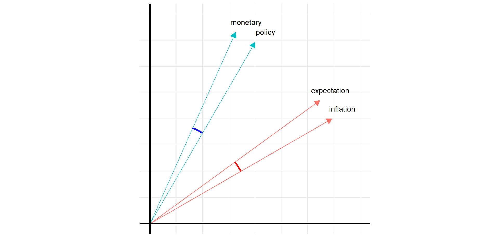

---
title: "Text as Data"
author: Thomas Delcey
categories: "Teaching"
date: "2026-03-09"
date-format: "YYYY-MM-DD"
sidebar: false
---

### Description

::: {.course-hero}
::: {.course-hero-text}
Une intervention de 3 heures pour des étudiants de master sur l’analyse textuelle, structurée autour d’un pipeline complet : création du corpus, représentation et mesure. Le cours couvre la constitution des données (OCR, web scraping, API), le pré-traitement (tokenisation, nettoyage, stemming/lemmatisation), puis les principales méthodes d’analyse : statistiques descriptives (fréquences, TF-IDF), approches supervisées (régression, classification), modèles non supervisés (LDA/STM) et leurs usages pour l’inférence. La séance se conclut par les limites du bag-of-words et une ouverture vers des représentations plus riches fondées sur le contexte (word embeddings, LLM).
:::

::: {.course-hero-image}
{height=320 fig-align="center"}
:::
:::

---

### Slides

```{=html}
<div id="slides-tad"></div>
<noscript>
  <p>JavaScript est requis pour afficher les slides ici.
    Accédez directement :
    <a href="CM_slides.html">Text as Data</a>.
  </p>
</noscript>
<script>
  window.addEventListener('DOMContentLoaded', function() {
    initSlideViewer('#slides-tad', [
      { file: 'CM_slides.html#/', label: 'Text as Data' }
    ], { storageKey: 'lastSlideTAD' });
  });
</script>
```


